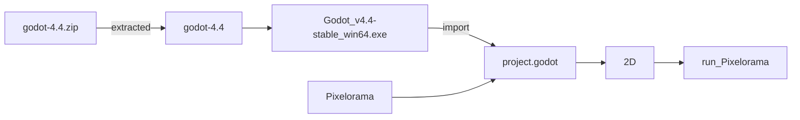

* This is a fork of https://github.com/Orama-Interactive/Pixelorama
* The purpose is just to learn how Pixelorama works and maybe I try to simplify the code for the feature that I don't need for my personal use

## saw the update based on godot4.4
* [previously it did not work](https://github.com/jamad/Pixelorama/wiki/Old-info#first-tested-to-open-the-file-in-v44)
  *   [Pixelorama on Godot v4.3 with VisualStudio](https://github.com/jamad/Pixelorama/wiki/Pixelorama-on-Godot-v4.3-with-VisualStudio) at that time, I had to use v4.3 by downloading godot-4.3.zip with VisualStudio2022 
* [After fetching from upstream to forked repository and updating data](https://github.com/jamad/Pixelorama/wiki/How-to-fetch-upstream-updates), Pixelorame worked on godot v4.4 as expected
  * 

## Learning how to use Pixelorama
* [Note on what I tried when started Pixelorama](https://github.com/jamad/Pixelorama/wiki) 

# Summary

