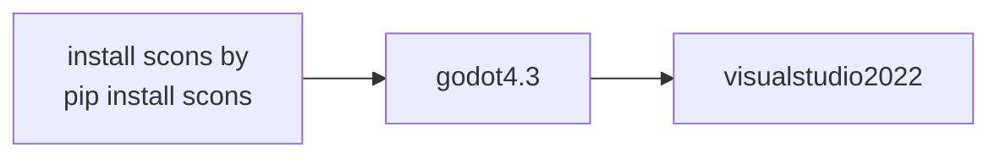

* a fork of https://github.com/Orama-Interactive/Pixelorama

# First, tested to open the file in v4.4
* 

* then its UI was visible in 2D panel
* 

* first run but got a problem
* 

# so, tried to open it in v4.3 by downloading godot-4.3.zip 
* then build by the following command
* `pip install scons` to install scons 
* `scons --version` to check scons
* `scons platform=windows target=editor vsproj=yes verbose=yes`
* opened `godot-4.3\godot-4.3\godot.sln`
* click `local windows debugger` button then wait the build (long time ) 
* 
* 

