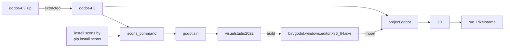

* This is a fork of https://github.com/Orama-Interactive/Pixelorama
* The purpose is just to learn how Pixelorama works and maybe I try to simplify the code for the feature that I don't need for my personal use

## saw the update based on godot4.4
* [previously it did not work](https://github.com/jamad/Pixelorama/wiki/Old-info#first-tested-to-open-the-file-in-v44)
* [After fetching from upstream to forked repository and updating data](https://github.com/jamad/Pixelorama/wiki/How-to-fetch-upstream-updates), Pixelorame worked on godot v4.4 as expected
* 

## Learning how to use Pixelorama
* [Note on what I tried when started Pixelorama](https://github.com/jamad/Pixelorama/wiki) 

# Summary

# so, tried to open it in v4.3 by downloading godot-4.3.zip 
* then build by the following command
* `pip install scons` to install scons 
* `scons --version` to check scons
* `scons platform=windows target=editor vsproj=yes verbose=yes`
* opened `godot-4.3\godot-4.3\godot.sln`
* click `local windows debugger` button then wait the build (long time ) 
* 
* imported "Pixelorama-master\project.godot"
* 
* clicked 2D mode, then ran the project
* 
* then Pixelorama worked as expected
* 

